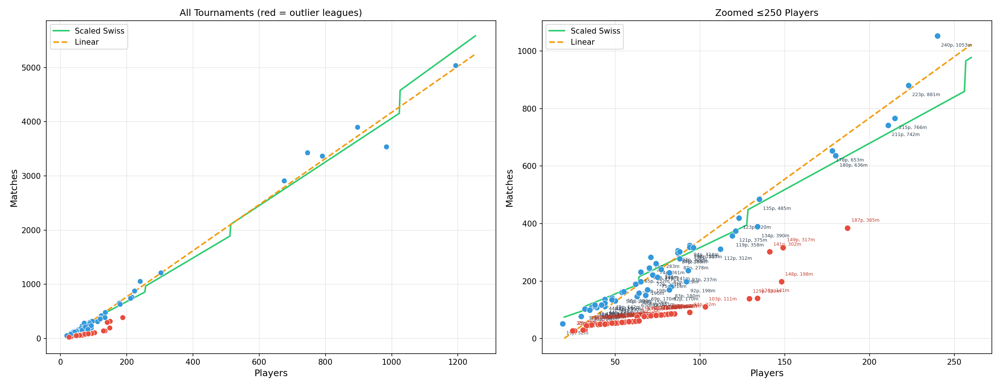

# Matches vs Players Relationship

**Date**: 2026-03-11
**Data**: 128 tournaments across Standard, Modern, Duel Commander, Legacy, Pauper.
**Script**: [`research/matches-vs-players.py`](matches-vs-players.py) — re-run with `uv run research/matches-vs-players.py`

Matches extracted as `sum(W + L + D) / 2` across all players from `data/**/melee-*.json`.

## Outlier Detection

49% of tournaments (63/128) are local leagues or short events (e.g. Standard RCQs) that run 2-3 rounds regardless of player count. These are detected by comparing the actual matches/player ratio against the expected Swiss ratio `ceil(log2(p)) / 2`. Tournaments below 55% of the expected ratio are flagged as outliers and excluded from the regression.

## Regression Results (65 clean tournaments)

| Formula | R² | MAE | Definition |
|---------|-----|-----|-----------|
| **Linear** | **0.9912** | **52** | `m = 4.26p - 84.2` |
| Cubic | 0.9917 | 49 | `m = -0.0000008p³ + 0.0011p² + 3.93p - 68.3` |
| Scaled Swiss | 0.9898 | 56 | `m = 0.81 · p·⌈log₂p⌉/2 + 34.6` |

### Performance on Large Tournaments (500+ players, n=6)

| Formula | MAE |
|---------|-----|
| Linear | 223 |
| Cubic | 210 |
| Scaled Swiss | 283 |

The linear model is the best general-purpose estimator. The cubic marginally improves on large events but adds complexity. The scaled Swiss formula, while theoretically motivated, loses accuracy due to the step-wise `ceil(log2(p))` rounding at certain player counts.

## Plot

Left: all 128 tournaments. Right: zoomed to ≤250 players. Red points are outlier leagues excluded from the fit.

## Takeaway

**Use `matches ≈ 4.26p - 84` for estimating total matches in a full Swiss tournament.** About half the tournaments in the dataset are short-format events (leagues, RCQs) that don't follow the Swiss round structure and should be excluded from this model.
